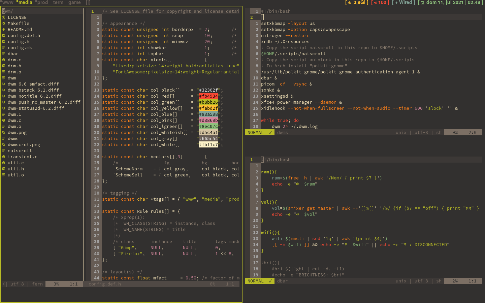

# 
dwm is an extremely fast, small, and dynamic window manager for X.

## Installation
1. Edit the config.def.h file to match your liking
2. Edit the `dwms`, `natscroll`, `autolock` and `dbar` scripts to match your liking
3. Run `sudo make clean install`

## Running dwm

Add the following line to your .xinitrc to start dwm using startx:

    dwms

You don't need to do anything if you use a login manager, as this build creates a dwm.desktop file and installs it on `/usr/share/xsessions`
so that your login manager can start dwm. Just log out, select dwm and that's it.

## Usage
Check for keybindings in `config.def.h`, if you want to add your own, I recommend using [sxhkd](https://github.com/baskerville/sxhkd)
> An example sxhdkrc file is in the repo

- To restart dwm in place after changing configuration use `MOD4+q`
- To quit dwm use `MOD4+Shift+q`
- To lock use `MOD4+x` (slock is needed, here's my build, )
- To configure and customize edit `config.def.h`, remove `config.h`, run `sudo make install`, press `MOD4+q` to restart.

Where MOD4 = WINDOWS/SUPER Key

## Dependencies
Check the `dwms`, `natscroll`, and `dbar` scripts for dependencies, modify them to add or remove dependencies.

## Notes
Some patches are not completely applied 
